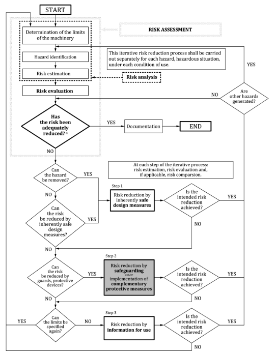

# Risk assessment

First, some definitions will be discussed out of Dutch safety Norm "NEN-EN-ISO 13849-1:2023 Veiligheid van machines - Onderdelen van besturingssystemen met een veiligheidsfunctie" regarding hazard, harm and risks. 

Hazard: Potential source of harm.  

Harm: Physical injury or damage to health.  

Risk: Combination fo the probability of the occurance of harm and the sevirity of that harm.  

Risk analysis: combination of the specification of the limits of the machine, hazard identification and risk estimation.  

Risk evaluation: judgement, on the basis of risk analysis, of whether risk reduction objectives have been achieved.  

Risk assessment: overall process comprising risk analysis and risk evaluation.  

